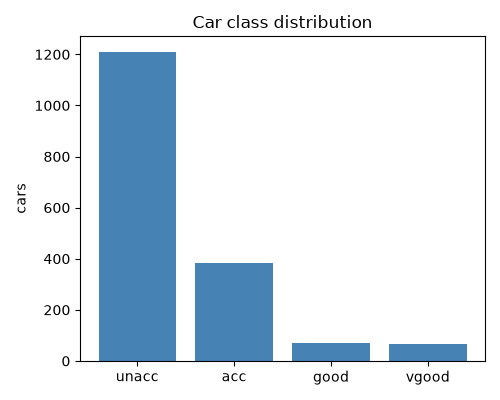
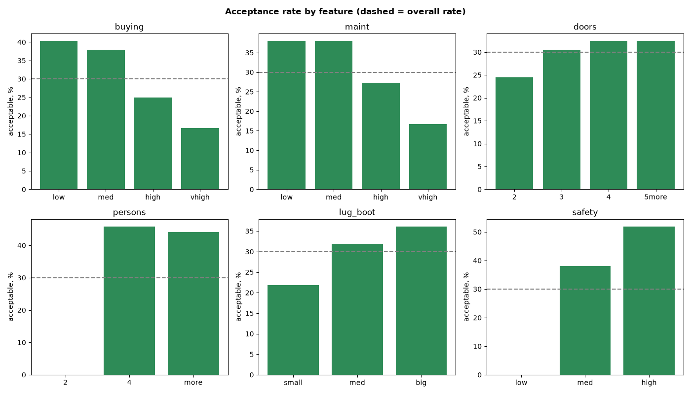
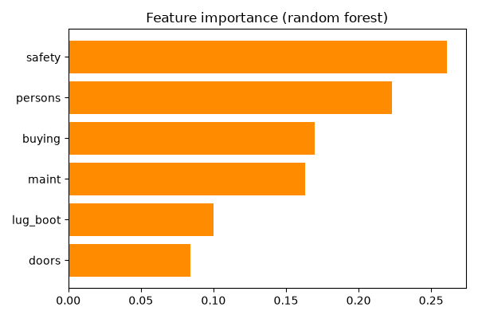
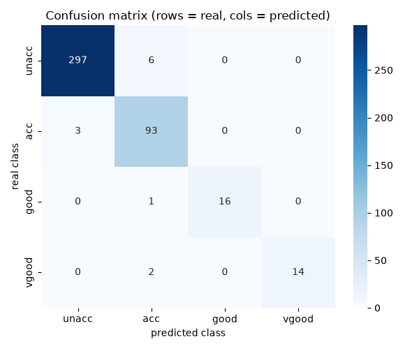

# Car Evaluation — Data Analysis

A simple, beginner-friendly analysis of the **UCI Car Evaluation** dataset.
The question: *what makes a car "acceptable", and can we predict the rating?*

Each car is rated as `unacc` / `acc` / `good` / `vgood` based on six features
(price, maintenance, doors, capacity, luggage boot, safety).

The script (`car_evaluation_analysis.py`) goes top to bottom:

1. Load the data (the file has no header, so we name the columns).
2. Quick check — missing values, duplicates, the values in each column.
3. Target — how the four classes are spread (it is imbalanced: 70% `unacc`).
4. Each feature vs the target — share of acceptable cars per category, with *lift*.
5. A random-forest model that predicts the class.
6. Cross-validation and comparison with a dummy baseline and logistic regression.
7. Feature importance — which features matter most.
8. A confusion matrix — where the model makes mistakes.
9. Save every result table to `results.xlsx` (one sheet per table).

## Source / dataset

Dataset: **[UCI Car Evaluation](https://archive.ics.uci.edu/dataset/19/car+evaluation)**
(`car.data`, 1,728 cars, 6 features + target `class`).

The dataset is **not** included in this repository (see `.gitignore`).
Download it from the link above and place it so the script finds it:

```
car-evaluation-analysis/
└── data/
    └── car.data
```

## How to run

```bash
pip install -r requirements.txt
python car_evaluation_analysis.py
```

The script can be run from any folder — it switches to its own directory first,
loads `data/car.data`, prints the results, saves charts to `figures/`, and writes
all result tables to `results.xlsx` (one sheet per table).

## Results

- **Safety and capacity matter most:** a car with `safety = low` is *never*
  acceptable (0%), and 2-person cars are always rejected.
- Random forest: **accuracy ≈ 0.97**, macro-F1 ≈ 0.92 (cross-validated).
- Logistic regression: accuracy ≈ 0.91; dummy baseline ≈ 0.70 (always predicts
  `unacc`) — the models clearly beat random.
- The confusion matrix shows mistakes happen only between *neighbouring* ratings
  (e.g. `vgood` predicted as `acc`), never between `unacc` and `good`/`vgood`.

## Figures

| | |
|---|---|
|  |  |
|  |  |
